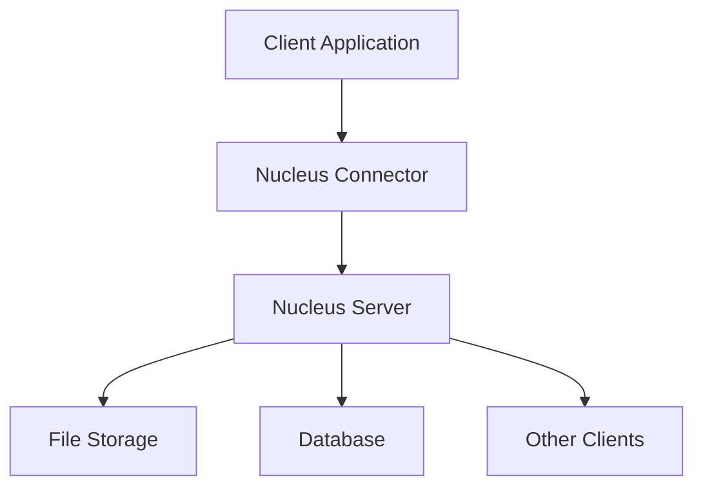

# NVIDIA Omniverse Nucleus 개요

## 🎯 Nucleus란?

NVIDIA Omniverse Nucleus는 **분산 콘텐츠 관리 시스템**으로, 3D 콘텐츠와 씬 데이터를 여러 클라이언트 간에 실시간으로 공유하고 협업할 수 있는 플랫폼입니다.

## 🚨 2025년 주요 변경사항

- **Omniverse Launcher 지원 중단** (2025년 10월 1일)
- **Nucleus Workstation 지원 중단** → Enterprise Nucleus Server로 마이그레이션
- **NGC Catalog 중심의 새로운 배포 방식**
- **Nucleus Bridge를 통한 Omniverse Cloud PaaS 연동**

## 🏗️ 핵심 아키텍처

### 1. Nucleus Server
- **역할**: 중앙 집중식 데이터 저장소
- **기능**: 파일 버전 관리, 접근 권한 제어, 실시간 동기화
- **프로토콜**: HTTP/HTTPS, WebSocket

### 2. Nucleus Client
- **역할**: 클라이언트 애플리케이션과의 인터페이스
- **지원 앱**: Maya, 3ds Max, Blender, Unreal Engine, Unity
- **연결 방식**: Omniverse Connector

### 3. Nucleus Database
- **역할**: 메타데이터 및 사용자 정보 저장
- **기술**: PostgreSQL 기반
- **데이터**: 사용자 권한, 파일 히스토리, 협업 정보

## 🔄 데이터 플로우



## 💼 실무 활용 사례

### 1. 3D 콘텐츠 협업
```python
# USD 파일 실시간 협업 예제
import omni.client

# Nucleus 서버 연결
omni.client.set_server("omniverse://your-nucleus-server")

# 파일 열기 및 수정
stage_url = "omniverse://server/Projects/MyProject/scene.usd"
stage = Usd.Stage.Open(stage_url)

# 실시간 변경사항 적용
stage.Save()
```

### 2. 에셋 라이브러리 관리
- **중앙 집중식 에셋 저장소**
- **버전 관리 및 의존성 추적**
- **메타데이터 기반 검색**

### 3. 파이프라인 자동화
```bash
#!/bin/bash
# Nucleus 파이프라인 자동화 스크립트

# 새 프로젝트 생성
curl -X POST "http://nucleus-server:8080/api/projects" \
  -H "Content-Type: application/json" \
  -d '{"name": "NewProject", "template": "default"}'

# 파일 업로드
omniverse-cli upload ./assets/*.usd omniverse://server/Projects/NewProject/
```

## 🔧 주요 기능

### 1. 실시간 협업
- **Live Sync**: 실시간 변경사항 동기화
- **Conflict Resolution**: 충돌 해결 메커니즘
- **Presence System**: 사용자 활동 추적

### 2. 버전 관리
- **Checkpoint System**: 자동 체크포인트 생성
- **Branch Management**: 브랜치 생성 및 병합
- **Rollback**: 이전 버전으로 롤백

### 3. 권한 관리
```json
{
  "users": [
    {
      "username": "artist01",
      "role": "contributor",
      "permissions": ["read", "write"],
      "projects": ["ProjectA", "ProjectB"]
    },
    {
      "username": "lead01",
      "role": "admin",
      "permissions": ["read", "write", "admin"],
      "projects": ["*"]
    }
  ]
}
```

## 🌐 네트워크 아키텍처

### 포트 구성 (2025 업데이트)
- **HTTP**: 3009 (Nucleus 메인 서버)
- **HTTPS**: 443 (보안 연결)
- **관리 인터페이스**: 8080
- **Database**: 5432 (PostgreSQL)
- **Nucleus Bridge**: UDP 60000 (Cloud 연동)

### 보안 고려사항
- **SSL/TLS 암호화**
- **OAuth 2.0 인증**
- **RBAC (Role-Based Access Control)**

## 📊 성능 특성

### 동시 사용자 수
- **권장**: 50-100명
- **최대**: 500명 (하드웨어 의존)

### 파일 크기 제한
- **단일 파일**: 10GB
- **프로젝트 전체**: 1TB

### 네트워크 대역폭
- **최소**: 10 Mbps
- **권장**: 100 Mbps
- **최적**: 1 Gbps

## 🔗 관련 링크

- [[02-Installation/System-Requirements|시스템 요구사항]]
- [[03-Configuration/Performance-Tuning|성능 최적화]]
- [[04-API-Integration/REST-API|REST API 가이드]]